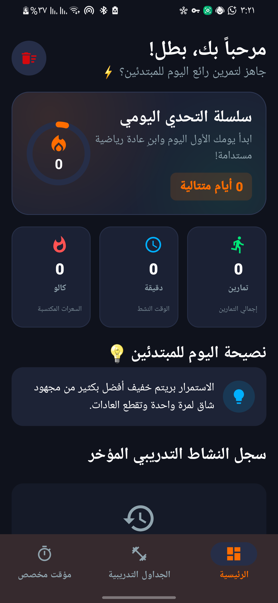
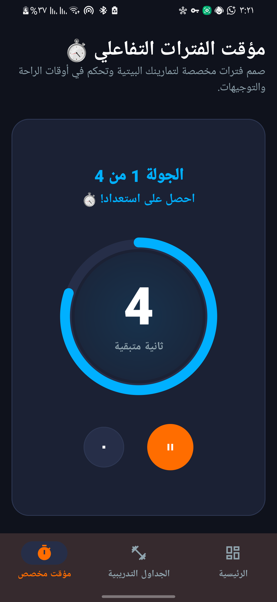
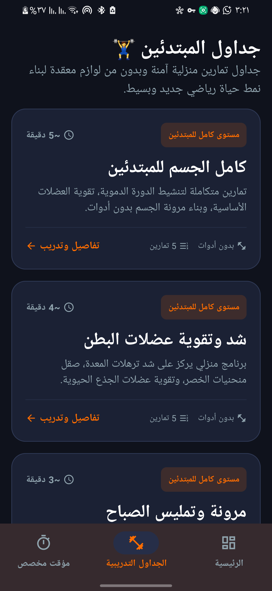

# 📱 مؤقتي

تطبيق أندرويد يساعدك على تنظيم وإدارة أوقات الراحة والتدريب بسهولة.

---

# ✨ Features

- ⏱️ إدارة أوقات الراحة
- 📅 تنظيم الجداول التدريبية
- 🎯 واجهة عربية جميلة
- ⚡ أداء سريع وسهل الاستخدام

---

# 📸 لقطات الشاشة

  

---

# 🚀 Run Locally

## المتطلبات

- Android Studio
- Android SDK
- Kotlin Support

---

## خطوات التشغيل

1. افتح Android Studio
2. اختر **Open**
3. افتح مجلد المشروع
4. انتظر حتى يتم تحميل Gradle
5. شغل التطبيق على المحاكي أو الهاتف

---

# 🛠️ Technologies Used

- Kotlin
- Android SDK
- Material Design

---

# 👨‍💻 Developer

تم تطوير التطبيق بواسطة وليد.
